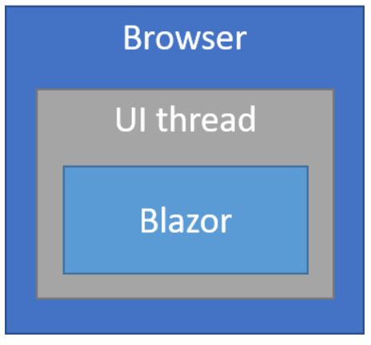
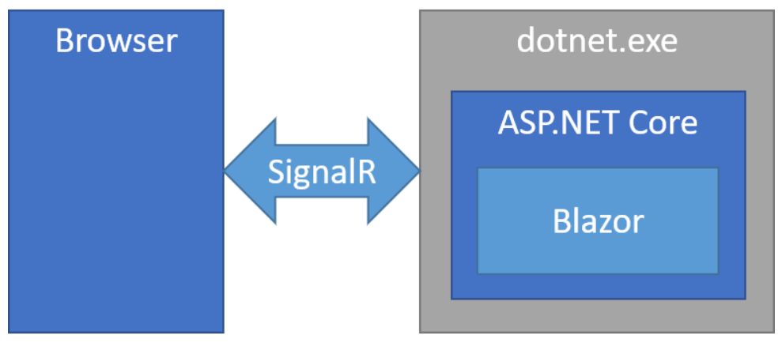
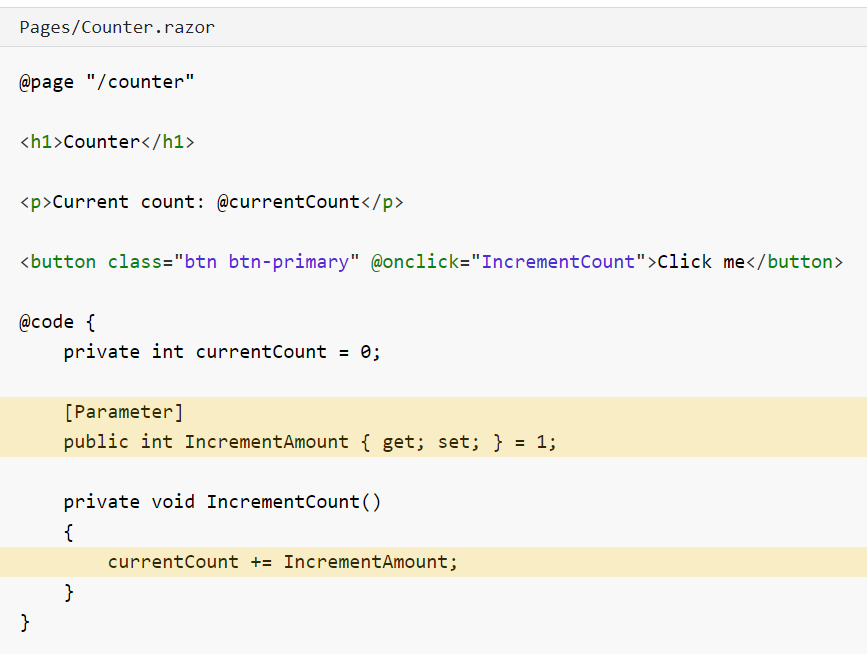
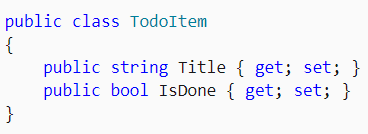
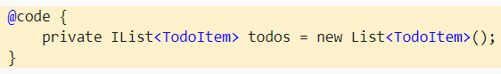
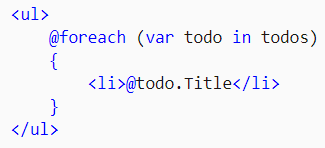
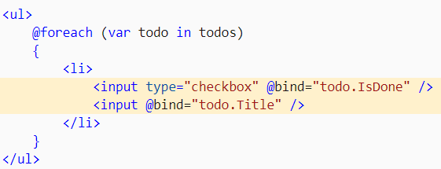

# README

## Introduction Blazor

Blazor = framework web conçu pour s'éxecuter soit :
- côté client dans le navigateur avec un runtime .NET basé sur webAssembly (Blazor WebAssembly)
- Côté serveur avec ASP.NET Core (Blazor Server)

Avec **WebAssembly** : l'app, les dépendances et le runtime .NET sont téléchargés dans le navigateur. Le thread UI du navigateur exécute ensuite l'application. Les maj d'interfaces et la gestion des évènements se déroulent dans le même process.

_Les ressources de l'app sont déployées en tant que fichiers statiques sur un serveur web capable de servir du contenu statique au client. (A creuser)_

Les interactions entre l'app blazor et l'ASP.NET Core app se font via
- Des appels web API
- SignalR



**blazor.webassembly.js** = script qui gère :
- Téléchargement du Runtime .NET, de l’application et des dépendances de l’application.
- Initialisation du runtime pour exécuter l’application.

**Avantages WebAssembly** : 
	- Pas de dépendance à un serveur .NET. L'app tourne parfaitement une fois téléchargée côté client et utilise les resources du client.
	- Le travail est déchargé du serveur vers le client
	- Un serveur ASP.NET core n'est pas requis, des scénarios serverless sont disponibles. 

**Inconvénients WebAssembly** : 
	- Limitée aux fonctionnalités du navigateur
	- Prise en charge de webAssembly côté client requis. 
	- L'app met plus de temps à charger parce que téléchargée côté client
	- Runtime .NET moins mature

Avec **Blazor Server** : l'application blazor exécutée côté serveur dans une app ASP.NET Core. Les maj d'UI et la gestion d'événements se font via signalR.

Le blazor.server.js script établit la connexion client. La classe Startup initialise les services côté serveur et ajoute l'app blazor dans le pipeline de gestion des requêtes. 



**Avantages Blazor Server** : 
	- Taille de téléchargement significativement plus petite
	- Tire pleinement des capacités du serveur 
	- .NET Core côté serveur est utilisé pour faire tourner l'app donc on peut utiliser les outils .NET par exemple le deboguage
	- Pas obligé que le client soit compatible webAssembly

**Inconvénients Blazor Server** : 
	- Plus haute latence parce qu'à chaque interaction tu passes du réseau client vers le réseau serveur ou vice-versa
	- Ne marche pas offline, si la connection au client fail, l'app ne marche plus du tout
Un serveur ASP.NET core est requis pour faire tourner l'app et il faut qu'il supporte plusieurs connections client, gérer son état. => être scalable. 

**Création d'une app blazor** : 
	- dotnet new blazorserver -o BlazorApp --no-https (pour une exécution côté serveur sans https enabled)
	- dotnet new blazorwasm -o BlazorApp --hosted (pour une exécution côté client avec un backend ASP.NET Core)

**Création d'un composant blazor dans l'app** : dotnet new razorcomponent -n Todo -o Pages

Constitution d'une app blazor : 

	• Program.cs is the entry point for the app that starts the server.
	• Startup.cs is where you configure the app services and middleware.
	• App.razor is the root component for the app.
	• The BlazorApp/Pages directory contains some example web pages for the app.
	• BlazorApp.csproj defines the app project and its dependencies.
	• Shared : Contient les composant partagées dans l'app :
    ° NavMenu.razor : menu de l'app

**Lancement** : dotnet run

## Counter

**Ajouter un composant** : Chaque fichier .razor définit un composant UI qui peut être réutilisé. 

Example d'inclusion du composant Counter : 
```html
@page "/"
		
<h1>Hello, world!</h1>
		
Welcome to your new app.
		
<SurveyPrompt Title="How is Blazor working for you?" />
		
<Counter />
```

**Modifier un composant** : Chaque composant a une partie avec du html (@page "/counter") et un bloc C# : @code { … }

Dans ce bloc code, on peut spécifier (comme pour une classe C#, des paramètres et des méthodes) 

Example : 



On peut setter ces paramètres dans le composant parent : 

```html
<Counter IncrementCount="10" />
```

## TodoItem

Les paramètres peuvent avoir comme type une classe C# définie dans un fichier .cs : 

**Insertion de code C# dans l'HTML** :





**Lier un élément HTML avec une variable C#** : 





## FetchData

 Ce composant démontre comment récupérer des données d'un service

**Injecter une classe service dans une page razor** : 

```cs
@using TodoList.Data
@inject WeatherForecastService ForecastService
```
Avec TodoList.Data contenant WeatherForecastService.cs.

**Invoquer une méthode quand le composant est prêt à être démarré**:

```cs

@code {
    private WeatherForecast[] forecasts;

    protected override async Task OnInitializedAsync()
    {
        forecasts = await ForecastService.GetForecastAsync(DateTime.Now);
    }
}

```

**Exemple de tableau avec des données d'une variable**:

```html 
<table class="table">
        <thead>
            <tr>
                <th>Date</th>
                <th>Temp. (C)</th>
                <th>Temp. (F)</th>
                <th>Summary</th>
            </tr>
        </thead>
        <tbody>
            @foreach (var forecast in forecasts)
            {
                <tr>
                    <td>@forecast.Date.ToShortDateString()</td>
                    <td>@forecast.TemperatureC</td>
                    <td>@forecast.TemperatureF</td>
                    <td>@forecast.Summary</td>
                </tr>
            }
        </tbody>
    </table>
```

## Two-way data binding

**@bind** : Fonctionnalité de liaison de données 

Types de données supportés : 

- string
- int 
- DateTime
- Enum
- Bool

Si besoin d'un autre type : decimal => Fournir getter/setter

Example : 

```html 
@page "/twowaydatabinding"

<p>
    Enter your name: <input type="text" @bind="Name" /><br />
</p>

<h2>Hello @Name!</h2>

@code {
    private string Name { get; set; }
}
```